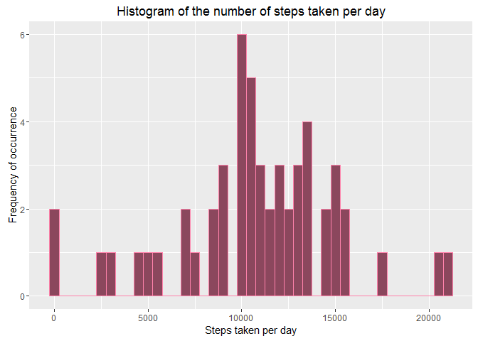
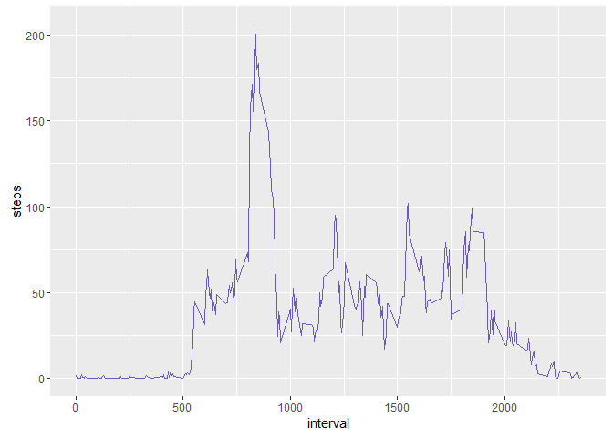
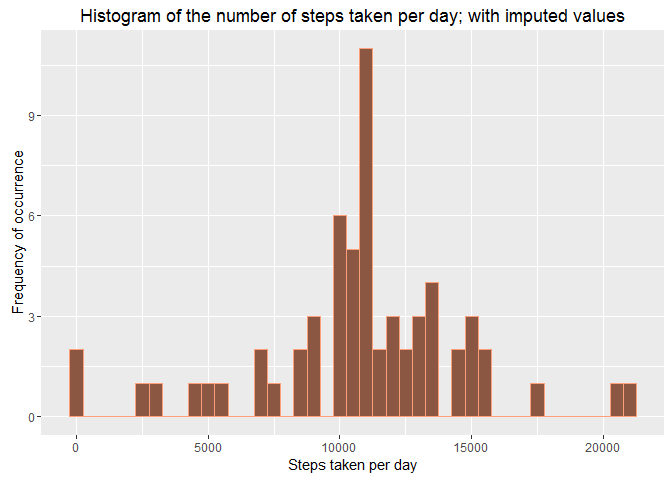
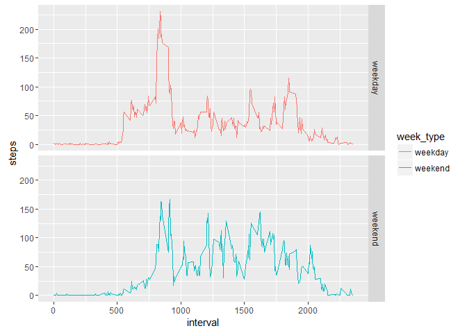

# Reproducible Research: Peer Assessment 1

## Introduction

It is now possible to collect a large amount of data about personal movement using activity monitoring devices such as a Fitbit, Nike Fuelband, or Jawbone Up. These type of devices are part of the "quantified self" movement - a group of enthusiasts who take measurements about themselves regularly to improve their health, to find patterns in their behavior, or because they are tech geeks. But these data remain under-utilized both because the raw data are hard to obtain and there is a lack of statistical methods and software for processing and interpreting the data.

Below are the results from Reproducible Data Project Assignment 1, written on R markdown and compiled with Knitr.

##### Load necessary packages & make sure echo is set true as default.

```r
library(knitr)
opts_chunk$set(echo = TRUE)
library(lubridate)
library(dplyr)
library(ggplot2)
```

## Loading and preprocessing the data

##### NOTE: Code here assumes the data zip file is in working directory
##### Unzip and read the csv file

```r
unzip("./activity.zip")
activity <- read.csv("activity.csv", head=TRUE)
```

##### Use lubridate to change the date column into datetype format

```r
activity$date <- ymd(activity$date)
```

##### Check out the data and make sure everything is in order


```r
str(activity)
```

```
## 'data.frame':	17568 obs. of  3 variables:
##  $ steps   : int  NA NA NA NA NA NA NA NA NA NA ...
##  $ date    : Date, format: "2012-10-01" "2012-10-01" ...
##  $ interval: int  0 5 10 15 20 25 30 35 40 45 ...
```

```r
head(activity)
```

```
##   steps       date interval
## 1    NA 2012-10-01        0
## 2    NA 2012-10-01        5
## 3    NA 2012-10-01       10
## 4    NA 2012-10-01       15
## 5    NA 2012-10-01       20
## 6    NA 2012-10-01       25
```

## What is mean total number of steps taken per day?

##### 1) Make a histogram of the total number of steps taken each day

First filter the NAs out of the data, then use group_by & summarize to summarize the steps by date


```r
activity_nona <- filter(activity, !is.na(activity$steps))
grp <- group_by(activity_nona, date)
numsteps <- summarize(grp, steps = sum(steps))
head(numsteps)
```

```
## # A tibble: 6 x 2
##         date steps
##       <date> <int>
## 1 2012-10-02   126
## 2 2012-10-03 11352
## 3 2012-10-04 12116
## 4 2012-10-05 13294
## 5 2012-10-06 15420
## 6 2012-10-07 11015
```

Use ggplot to plot the histogram

```r
g <- ggplot(numsteps, aes(x = steps))
g + geom_histogram(colour = "palevioletred1", fill = "palevioletred4", binwidth = 500)+
  ggtitle("Histogram of the number of steps taken per day")+
  xlab("Steps taken per day")+
  ylab("Frequency of occurrence")
```

<!-- -->

##### 2) Calculate the mean and median of the total number of steps taken per day


```r
meansteps <- mean(numsteps$steps)
mediansteps <- median(numsteps$steps)
```

Printing the results


```r
meansteps
```

```
## [1] 10766.19
```

```r
mediansteps
```

```
## [1] 10765
```

Mean number of steps taken per day is 10766 and the median number of steps take per day is 10765


## What is the average daily activity pattern?

##### 1) Make a time series plot (Line) of the 5min interval and the average number of steps taken, averaged across all days.

First calculate the average number of steps taken in each 5 mins interval across the days.


```r
grp2 <- group_by(activity_nona, interval)
numsteps2 <- summarize(grp2, steps = mean(steps))
```

Use ggplot to plot the time series plot.


```r
g <- ggplot(numsteps2, aes(x=interval, y=steps))
g + geom_line(color = "slateblue3")
```

<!-- -->

##### 2) Which 5-minute interval, on average across all the days in the dataset, contains the maximum number of steps?

Using which.max to find which 5-min interval has the most number of steps taken.


```r
numsteps2[which.max(numsteps2$steps),]
```

```
## # A tibble: 1 x 2
##   interval    steps
##      <int>    <dbl>
## 1      835 206.1698
```

The 835 mins interval has the most number of steps taken; with an average of 206 steps.

## Imputing missing values

#####1) Calculate and report the total number of missing values in the dataset (i.e. the total number of rows with NAs).

Summarizing the missing values.

```r
sum(is.na(activity$steps))
```

```
## [1] 2304
```

The number of missing values are 2304.

#####2) Devise a strategy for filling in all of the missing values in the dataset. The strategy does not need to be sophisticated. For example, you could use the mean/median for that day, or the mean for that 5-minute interval, etc.


```r
activity_full <- activity
na_rows <- is.na(activity_full$steps)
avgbyint <- tapply(activity_full$steps, activity_full$interval, mean, na.rm=TRUE)
```

#####3) Create a new dataset that is equal to the original dataset but with the missing data filled in.


```r
activity_full$steps[na_rows] <- avgbyint[as.character(activity_full$interval[na_rows])]
head(activity_full)
```

```
##       steps       date interval
## 1 1.7169811 2012-10-01        0
## 2 0.3396226 2012-10-01        5
## 3 0.1320755 2012-10-01       10
## 4 0.1509434 2012-10-01       15
## 5 0.0754717 2012-10-01       20
## 6 2.0943396 2012-10-01       25
```

Check number of missing values is 0


```r
sum(is.na(activity_full$steps)) == 0
```

```
## [1] TRUE
```

##### 4) Make a histogram of the total number of steps taken each day and calculate and report the mean and median total number of steps taken per day. Do these values differ from the estimates from the first part of the assignment? What is the impact of imputing missing data on the estimates of the total daily number of steps?

Use group_by & summarize to summarize the steps by date


```r
grp3 <- group_by(activity_full, date)
numsteps3 <- summarize(grp3, steps = sum(steps))
head(numsteps3)
```

```
## # A tibble: 6 x 2
##         date    steps
##       <date>    <dbl>
## 1 2012-10-01 10766.19
## 2 2012-10-02   126.00
## 3 2012-10-03 11352.00
## 4 2012-10-04 12116.00
## 5 2012-10-05 13294.00
## 6 2012-10-06 15420.00
```

Use ggplot to draw the histogram again

```r
g3 <- ggplot(numsteps3, aes(x = steps))
g3 + geom_histogram(colour = "lightsalmon1", fill = "lightsalmon4", binwidth = 500)+
  ggtitle("Histogram of the number of steps taken per day; with imputed values")+
  xlab("Steps taken per day")+
  ylab("Frequency of occurrence")
```

<!-- -->

Calculate the mean and median of the total number of steps taken per day again


```r
meansteps3 <- mean(numsteps3$steps)
mediansteps3 <- median(numsteps3$steps)
```

Printing the results


```r
meansteps3
```

```
## [1] 10766.19
```

```r
mediansteps3
```

```
## [1] 10766.19
```

Mean number of steps taken per day is 10766 and the median number of steps take per day is 10766. The imputing of the new values into the NA fields resultsed in the mean and median being the same.

## Are there differences in activity patterns between weekdays and weekends?

#####1) Create a new factor variable in the dataset with two levels - "weekday" and "weekend" indicating whether a given date is a weekday or weekend day.

Write function to indicate if date is weekday or weekend

```r
weekend <- function(actdate) {
  ifelse(weekdays(actdate) == "Saturday" | weekdays(actdate) == "Sunday","weekend","weekday") 
}
```

Impute a new column using the function above to indicate which days are weekday or weekend


```r
activity_full <- mutate(activity_full, week_type = weekend(activity_full$date))
head(activity_full)
```

```
##       steps       date interval week_type
## 1 1.7169811 2012-10-01        0   weekday
## 2 0.3396226 2012-10-01        5   weekday
## 3 0.1320755 2012-10-01       10   weekday
## 4 0.1509434 2012-10-01       15   weekday
## 5 0.0754717 2012-10-01       20   weekday
## 6 2.0943396 2012-10-01       25   weekday
```

##### 2) Make a panel plot containing a time series plot (i.e. type = "l") of the 5-minute interval (x-axis) and the average number of steps taken, averaged across all weekday days or weekend days (y-axis).

First calculate the average number of steps taken in each 5 mins interval across the days by weektype


```r
grp4 <- group_by(activity_full, week_type, interval)
numsteps4 <- summarize(grp4, steps = mean(steps))
head(numsteps4)
```

```
## Source: local data frame [6 x 3]
## Groups: week_type [1]
## 
##   week_type interval      steps
##       <chr>    <int>      <dbl>
## 1   weekday        0 2.25115304
## 2   weekday        5 0.44528302
## 3   weekday       10 0.17316562
## 4   weekday       15 0.19790356
## 5   weekday       20 0.09895178
## 6   weekday       25 1.59035639
```

Then plot the 2 panel time series plot of the average steps taken by the 5-min interval by week type.


```r
g <- ggplot(numsteps4, aes(x=interval, y=steps, color = week_type))
g + geom_line()+
  facet_grid(week_type~.)
```

<!-- -->

The test subjects seem to be more active during the morning and slightly more during the evening on weekdays. This might correspond to office hours. Activity is quite consistent during the day on weekends - due to no work perhaps.
